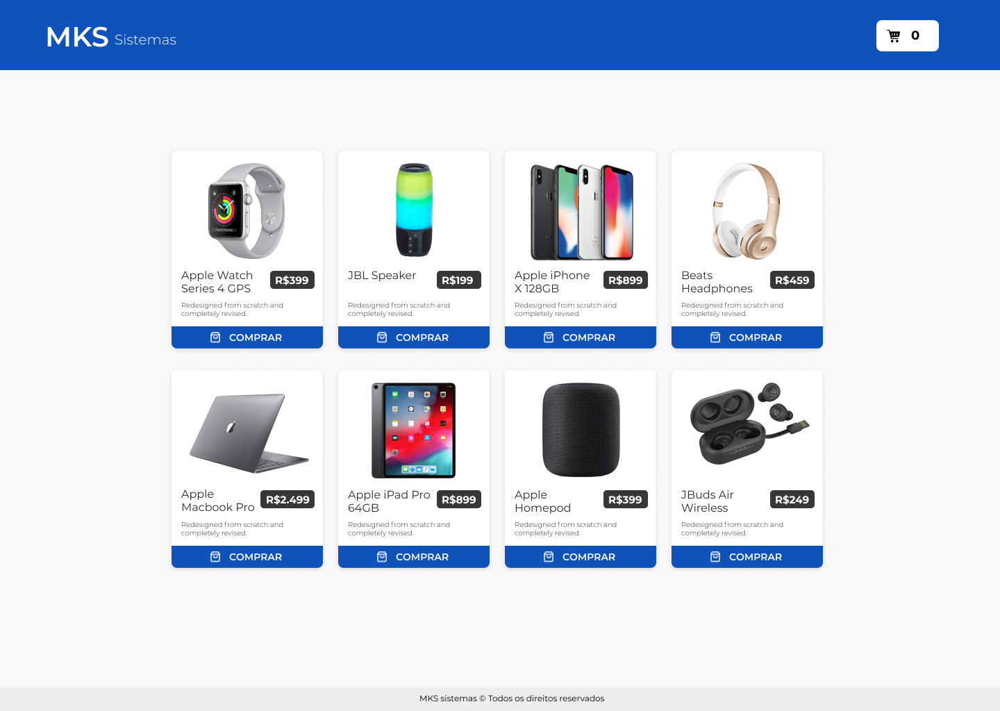

<h1 align='center'>MKS Sistemas</h1>



<p>Aplicação para processo seletivo desenvolvedor Front-End.</p>

## :page_facing_up: Explicação

A função principal do projeto é a listagem de produtos de um e-commerce.

## :dart: Passos

:heavy_check_mark: Tela de listagem dos produtos;\
:heavy_check_mark: Criação dos componentes;\
:heavy_check_mark: Estilização de componentes utilizando Styled Components;\
:heavy_check_mark: Listagem com chamada à API utilizando React Query;\
:heavy_check_mark: Criação de funções;\
:heavy_check_mark: Animações com framer motion;

## :rocket: Tecnologias

As seguintes ferramentas foram utilizadas neste projeto:

- [React](https://react.dev/)
- [Next](https://nextjs.org/)
- [TypeScript](https://www.typescriptlang.org/docs/)
- [Styled Components](https://styled-components.com/)
- [React Query](https://tanstack.com/)
- [Jest](https://jestjs.io/pt-BR/)

 ## 🌐: Link do Projeto no Ar:

- [Projeto](https://mks-sistemas-mu.vercel.app/)

## :closed_book: Requisitos ##

Antes de começar, você precisa ter [Git](https://git-scm.com) e [Node](https://nodejs.org/en/) instalados em seu computador.

## :checkered_flag: Getting Started ##

```bash
# Clone o projeto
$ git clone https://github.com/joaoviictorss/mks-sistemas

# Accesso
$ cd mks-sistemas

# Instalando dependencias
$ npm install

# Rodando o projeto
$ npm run start

```
